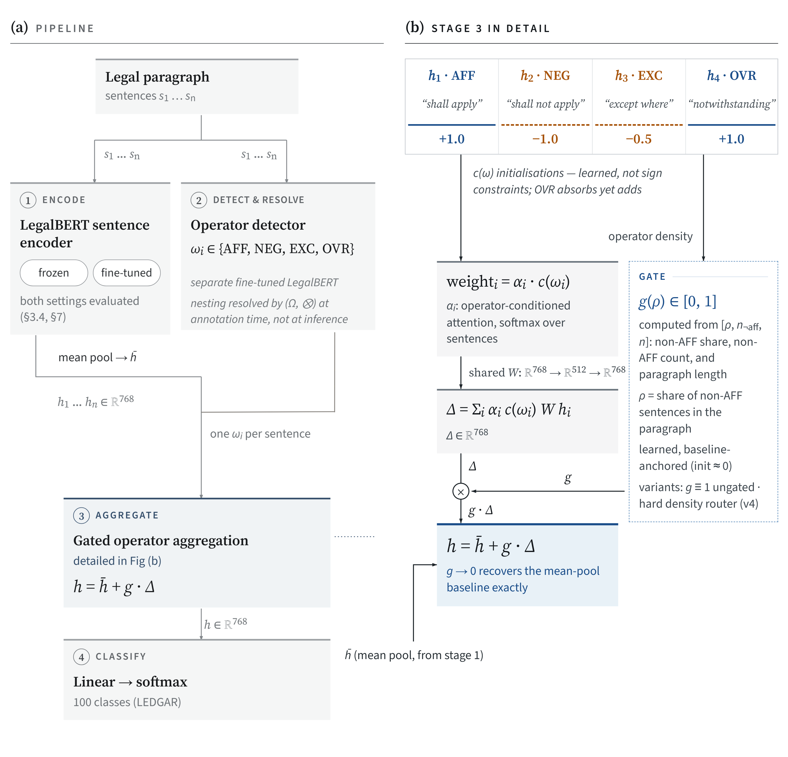
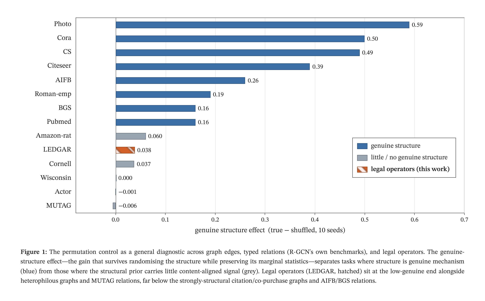
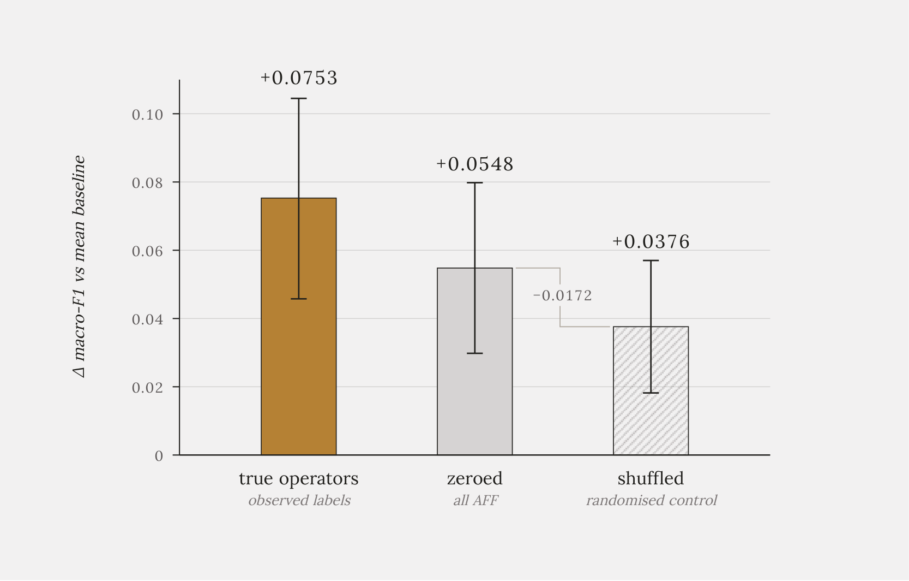
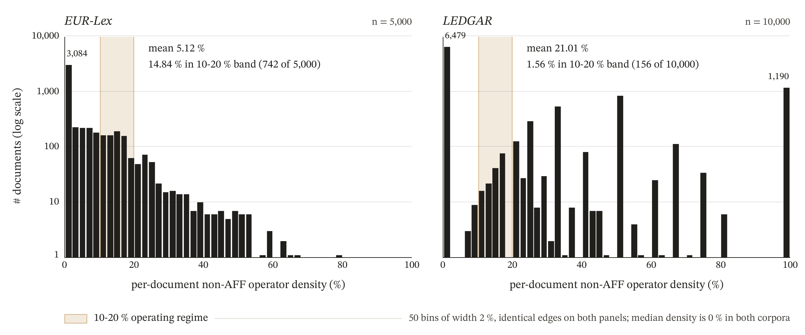
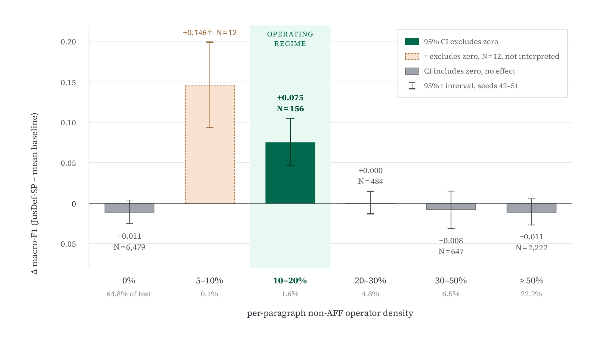
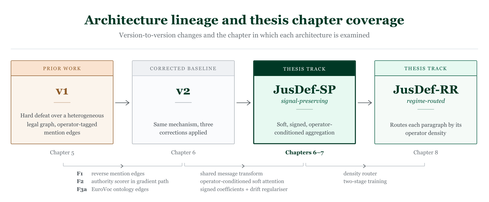

# JusDef

Defeasibility-aware graph neural networks for legal text classification, and a permutation control for deciding whether a structural prior is doing any work.

Research code, data and analyses for the doctoral thesis *When Does Structure Help?* (Università degli Studi di Milano, Dipartimento di Informatica "Giovanni Degli Antoni").

---

## What this is

Legal rules defeat one another. A provision applies until an exception, a negation or an override cancels it. Standard neural architectures aggregate monotonically, so every input adds evidence and nothing can cancel anything. This repository contains an architecture that makes four legal operators (AFF, NEG, EXC, OVR) first-class in message passing, and the apparatus built to test whether that actually helps.



*The JusDef-SP aggregation layer (`src/model/v3_layer.py`). Sentence embeddings from a frozen LegalBERT are projected and pooled; the layer applies a single shared message transform, operator-conditioned soft attention, and per-operator signed coefficients under an L2 drift regulariser, returning a residual update on the pooled representation.*


**It mostly does not, and establishing that is the point.**

A three-arm permutation control attributes roughly **three-quarters** of the architecture's best result to added model capacity rather than to operator meaning. Fine-tuning the encoder removes the benefit entirely. On the same task a TF-IDF baseline (0.827) is level with a fully fine-tuned LegalBERT (0.829).

The durable contribution is the control, not the model. It applies to any claimed structural prior over typed-edge graphs, and it has been validated across eighteen node- and entity-classification benchmarks where it correctly separates signals that are genuinely used from those that are not.



*Genuine structural effect (true minus shuffled) across eighteen benchmarks. Homophilous citation and co-purchase graphs use their edges; WebKB, Actor, Minesweeper, Squirrel and MUTAG's relation types do not. Legal operators return the second signature.*


For the full account, read [`PROJECT_OVERVIEW.md`](PROJECT_OVERVIEW.md).

---

## The permutation control

The idea in one table. Train three times: with real structure, with the structure randomly permuted, and with it removed entirely.

| Arm | Operator information | Gain over mean baseline (10 seeds) |
|---|---|---|
| True | real labels | **+0.0753** |
| Shuffled | labels permuted | +0.0376 |
| Zeroed | none, all AFF | **+0.0548** |

The zeroed arm recovers most of the gain with no operator information at all. Real operators beat randomised ones by +0.038 (`p ≈ 0.02`), but beat *no* operators by only +0.021 (`p ≈ 0.08`).

If you are adding structure to a graph model and reporting an improvement, two extra training runs will tell you whether you have a mechanism or just parameters.



*The three arms on the LEDGAR operating regime, ten seeds each. The zeroed arm carries most of the gain with no operator information at all.*


```bash
python scripts/analyse_thirdarm.py       # JusDef, LEDGAR
python scripts/perm_control_gnn.py       # Cora / Citeseer / Pubmed and heterophilous graphs
python scripts/perm_control_rgcn.py      # AIFB / MUTAG / BGS relation types
```

---

## Released resources

These are usable independently of any verdict on the architecture.

| Resource | Location | Notes |
|---|---|---|
| Operator-annotated corpus | `data/annotations/operator_labels_3000.jsonl` | 3,000 EUR-Lex sentences, four operator classes |
| Annotation guidelines | `data/annotations/operator_guidelines.md` | the decision rules the labels follow |
| Inter-annotator agreement files | `data/annotations/iaa/` | 100-sentence self-review, 300-sentence peer annotation |
| Operator detector | `src/`, checkpoint in `outputs/checkpoints/` | fine-tuned LegalBERT, runs on any English legal corpus |
| Per-seed results | `outputs/logs/` | JSON logs backing every reported number |

**Corpus provenance.** Candidate labels were generated with Claude Sonnet 5 (Anthropic) in June 2026 under a fixed guideline, then validated by human annotation: a 100-sentence self-review at Cohen's κ = 0.79 (an upper bound, since it measures the labelling function against itself) and a 300-sentence blind annotation by an independent peer annotator at **κ = 0.77**. The detector's reliability against expert judgement is bounded by 0.77, not by its 0.977 validation score, which is a selected maximum rather than a clean held-out estimate.

---

## Quick start

Python 3.10. The pinned environment is CUDA-capable but the analysis scripts run on CPU.

```bash
git clone https://github.com/oziofficial5/jusdefv2.git
cd jusdefv2
python -m venv .venv && source .venv/bin/activate    # Windows: .venv\Scripts\activate
pip install -r requirements.txt
```

Key pins: `torch==1.13.1`, `torch_geometric==2.3.1`, `transformers==4.30.2`.

Nothing below needs a GPU or any downloaded dataset. Each reads the committed per-seed logs.

```bash
# The paragraph-length confound behind the operating regime
python scripts/analyse_ledgar_length_confound.py

# Density-stratified evaluation on LEDGAR
python scripts/analyse_ledgar_density_subset.py

# The three-arm permutation control
python scripts/analyse_thirdarm.py

# Cross-corpus operator density
python scripts/analyse_cross_corpus_density.py
```

Full training runs need an A100 and the raw corpora. See [`AMPERE_RUNBOOK.md`](AMPERE_RUNBOOK.md).

```bash
bash scripts/run_all_ampere.sh      # EUR-Lex pipeline, 5-8 days
bash scripts/run_pilot_ledgar.sh    # LEDGAR pilot, 5-7 hours
```

---

## Headline numbers

Operator density, measured with one detector applied to three corpora without retraining:

| Corpus | Non-AFF density |
|---|---|
| EUR-Lex, EU regulations | 0.71% |
| ECtHR, case-law facts | 0.52% |
| LEDGAR, US contract clauses | 20.03% |

A gap of 28×, more than an order of magnitude. These figures count *explicitly marked* operators only, and say nothing about defeasibility operating through *lex specialis* or *lex posterior* without a surface marker. EUR-Lex density is per mention-edge; LEDGAR and ECtHR are per sentence.



*Non-AFF operator density by corpus and operator class, log scale, per sentence on the left and per mention edge on the right so that only commensurable values share an axis.*


On LEDGAR, JusDef-SP beats a mean-aggregation baseline only in the 10-20% density band: **+0.0624** over five seeds (all five positive), **+0.0753** over ten. Nowhere else, and on neither low-density corpus.



*JusDef-SP minus the mean baseline by non-AFF density bin, ten seeds (42-51), frozen encoder. Bars are across-seed means with 95% t intervals.*


**This regime is a located boundary, not an explained one.** Density is `k/n` over integers, so the 10-20% band admits only paragraphs of six sentences or more. LEDGAR's median paragraph is two, and only 523 of 10,000 are eligible on length alone. An architecture that simply prefers longer paragraphs explains the same observations.

A within-corpus control does separate the two in part: holding length above the band's threshold, the advantage is **+0.0753** inside the band against **+0.0137** outside it, so density does work that length alone does not. It cannot dissolve the entanglement, because on a fixed corpus every in-band paragraph is long by construction. The corpus-level control was run in September 2026 on CUAD re-segmented at two sentence windows; the regime did not appear under either, so there was no in-band advantage to decompose. **The question remains open, and CUAD is not the corpus that will settle it.**

---

## Layout

```
src/model/        v3_layer.py (JusDef-SP), v4_router.py (JusDef-RR),
                  dmp_layer.py (hard DMP, v1/v2), baselines.py (R-GCN)
src/eval/         metrics and bootstrap (one-sided in the observed direction)
scripts/          pipeline entry points and every analysis in the thesis
data/annotations/ released corpus, guidelines, IAA files
notes/            diagnostic chronology
tests/            pytest suite
outputs/logs/     per-seed JSON results
```

`v3` and `v4` are code identifiers. In writing they are **JusDef-SP** (signal-preserving) and **JusDef-RR** (regime-routed).



*The four architectures, all defined over the same graph. v1 and v2 share the hard defeat gate and the operator-indexed weight matrices, differing only in the graph they run over and in whether the authority scorer receives gradient. JusDef-SP replaces that aggregation layer entirely; JusDef-RR keeps it and adds a density-conditioned router that decides, per paragraph, whether to apply it. The lineage is cumulative in the graph and discontinuous at the aggregation layer, which is where the argument sits.*


**Branches.** `thesis-main` is the default and contains the complete work. `jusdef-ledgar` is at the same commit. `jusdef-v3` is retained for provenance.

---

## Papers

- Khaliq, Montanelli, Dalianis & Naqvi. *JusDef: Defeasible Message Passing for Exception-Aware Legal Document Classification.* Artificial Neural Networks in Pattern Recognition, 12th IAPR TC3 Workshop, ANNPR 2026. Springer LNAI. [doi:10.1007/978-3-032-39028-8_6](https://doi.org/10.1007/978-3-032-39028-8_6)
- *When Does Defeasibility-Aware Neural Aggregation Help Legal Text Classification? Separating Mechanism from Added Capacity with a Permutation Control.* Artificial Intelligence and Law. Under review.
- Khaliq, Riva & Montanelli. *Evaluating Knowledge-Based Approaches for Legal Text Analysis: A Benchmark Study.* Computer Law & Security Review 61:106279, 2026. Elsevier. [doi:10.1016/j.clsr.2026.106279](https://doi.org/10.1016/j.clsr.2026.106279)
- Khaliq & Montanelli. *Language Models for Legal NLP: A Literature Review.* CAiSE 2025 Workshops, Springer LNBIP 556, 326-337. [doi:10.1007/978-3-031-94931-9_27](https://doi.org/10.1007/978-3-031-94931-9_27)

The ANNPR paper reports a positive result for the hard-defeat architecture. That evaluation tuned its decision threshold on test labels. Corrected, the result does not survive, and the thesis reports the correction in full. The AI & Law submission predates the paragraph-length confound described above and states the operating regime without that caveat; **the thesis is the current statement.**

---

## Citation

```bibtex
@phdthesis{khaliq2026jusdef,
  author  = {Khaliq, Awais Abdul},
  title   = {When Does Structure Help? Disentangling Mechanism from Capacity
             in Defeasibility-Aware Legal Text Classification},
  school  = {Universit\`a degli Studi di Milano},
  year    = {2026},
  type    = {PhD thesis},
  address = {Milan, Italy}
}
```

---

## Licence

- **Code** under the [MIT Licence](LICENSE).
- **The annotated corpus, guidelines and IAA files** (`data/annotations/`) under
  [CC BY 4.0](data/annotations/LICENSE).

The corpus derives from EUR-Lex, which is reusable under the European Commission's reuse policy with source attribution. LEDGAR and ECtHR are used under their respective LexGLUE and AUEB-NLP terms and are not redistributed here.

---

## Contact

Awais Abdul Khaliq, Dipartimento di Informatica "Giovanni Degli Antoni", Università degli Studi di Milano.
ORCID [0000-0002-3439-6256](https://orcid.org/0000-0002-3439-6256)

Issues and questions are welcome via the issue tracker.
